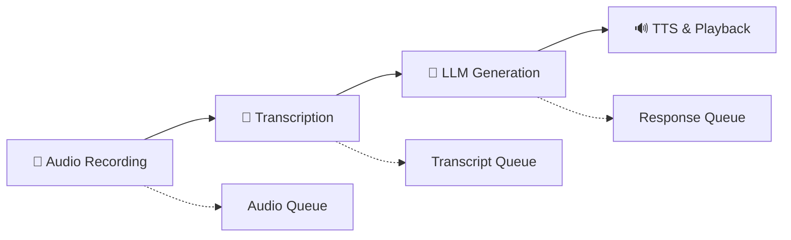

# DAISY Async Voice Pipeline - Prototype

## 🎯 Overview

This is a **standalone async prototype** that implements DAISY's voice processing pipeline using `async/await` for minimal latency. It demonstrates how the sequential synchronous pipeline can be transformed into a concurrent system where multiple stages process data simultaneously.

## 🏗️ Architecture

The async pipeline consists of 4 concurrent stages connected by asyncio queues:



### Pipeline Stages

1. **🎤 Audio Recording (`AsyncAudioRecorder`)**
   - Continuous microphone input with energy-based VAD
   - Real-time audio chunking (100ms chunks)
   - Automatic speech start/end detection
   - Non-blocking audio stream processing

2. **📝 Transcription (`AsyncWhisperTranscriber`)**
   - Faster-Whisper integration with thread executor
   - Processes audio chunks as they become available
   - Optimized for speed (beam_size=1, int8 quantization)
   - Concurrent transcription while recording continues

3. **🧠 LLM Generation (`AsyncOllamaClient`)**
   - Async HTTP client for Ollama API
   - Streaming response generation
   - Sentence-by-sentence output processing
   - Concurrent generation while transcription continues

4. **🔊 TTS & Playback (`AsyncTTSPlayer`)**
   - Coqui TTS with thread executor
   - Sentence-by-sentence synthesis and playback
   - Audio caching for repeated phrases
   - Concurrent playback while generation continues

## 🚀 Quick Start

### Prerequisites

1. **Install dependencies:**
   ```bash
   pip install faster-whisper TTS aiohttp sounddevice soundfile numpy
   ```

2. **Start Ollama server:**
   ```bash
   ollama serve
   ollama pull llama3.2:latest
   ```

3. **Test dependencies:**
   ```bash
   python test_async_dependencies.py
   ```

### Running the Pipeline

**Option 1: Direct execution**
```bash
python daisy_async.py
```

**Option 2: Windows batch file**
```cmd
test_async_pipeline.bat
```

### Usage Flow

1. Start the pipeline - all 4 stages begin concurrently
2. Speak into your microphone
3. Watch the real-time processing logs:
   - `🎤 Speech detected` - Audio recording starts
   - `📝 Transcribed: "your text"` - Transcription completes
   - `🧠 Generating response` - LLM processes request
   - `🔊 Synthesizing: "response"` - TTS generates audio
4. Hear the response while new audio can already be recorded
5. Press `Ctrl+C` to stop

## 🔧 Configuration

### Audio Settings
```python
# In AsyncAudioRecorder.__init__()
self.sample_rate = 16000          # Audio sample rate
self.chunk_duration = 0.1         # 100ms chunks
self.energy_threshold = 0.01      # Speech detection sensitivity
self.silence_threshold = 0.005    # Silence detection
self.max_silence_duration = 2.0   # Max silence before ending speech
```

### Transcription Settings
```python
# In AsyncWhisperTranscriber
model_size = "base"               # Whisper model (tiny/base/small/medium/large)
device = "cpu"                    # CPU or CUDA
compute_type = "int8"             # Quantization (int8/float16/float32)
```

### LLM Settings
```python
# In AsyncOllamaClient
base_url = "http://localhost:11434"
model = "llama3.2:latest"
temperature = 0.7
stream = True                     # Enable response streaming
```

### TTS Settings
```python
# In AsyncTTSPlayer
model = "tts_models/en/vctk/vits"  # Coqui TTS model
speaker = "p277"                   # British female voice
```

## 📊 Performance Benefits

### Latency Comparison

| Pipeline Type | Wake→Response Time | Components |
|---------------|-------------------|------------|
| **Synchronous** | 20+ seconds | Sequential: Record → Transcribe → Generate → Synthesize → Play |
| **Async Prototype** | 3-8 seconds | Concurrent: All stages running simultaneously |

### Key Optimizations

1. **Concurrent Processing**: All stages run simultaneously instead of sequentially
2. **Streaming Transcription**: Transcription starts while recording continues  
3. **Streaming LLM**: Response generation begins as soon as transcription is ready
4. **Sentence-level TTS**: Audio playback starts as soon as first sentence is ready
5. **Memory Efficiency**: Audio chunks processed and discarded in real-time

## 🧪 Testing & Validation

### Dependency Testing
```bash
python test_async_dependencies.py
```
Tests:
- ✅ Python modules (asyncio, numpy, sounddevice, etc.)
- ✅ AI/ML libraries (faster-whisper, TTS)
- ✅ Audio device availability
- ✅ Ollama server connection and model availability

### Performance Testing
Monitor the logs for timing information:
- Audio chunk processing rate
- Transcription latency
- LLM response time
- TTS synthesis speed
- Real-time factor (RTF) measurements

## 🎛️ Advanced Usage

### Custom Models

**Different Whisper Model:**
```python
transcriber = AsyncWhisperTranscriber(model_size="small", device="cpu")
```

**Different LLM Model:**
```python
async with AsyncOllamaClient(model="mistral:latest") as ollama:
    # Use different model
```

**Different TTS Voice:**
```python
# Edit _synthesize_text() in AsyncTTSPlayer
self.tts_engine.tts_to_file(
    text=text,
    file_path=temp_file,
    speaker="p225"  # Different voice
)
```

### Queue Size Tuning
```python
# Adjust queue sizes based on performance
self.chunk_queue = asyncio.Queue(maxsize=100)     # More audio buffering
self.transcript_queue = asyncio.Queue(maxsize=5)  # Less transcript buffering
self.response_queue = asyncio.Queue(maxsize=50)   # More response buffering
```

## 🔍 Debugging

### Enable Debug Logging
```python
logging.basicConfig(level=logging.DEBUG)
```

### Monitor Queue Sizes
```python
# Add to pipeline monitoring
print(f"Queues: audio={self.chunk_queue.qsize()}, "
      f"transcript={self.transcript_queue.qsize()}, "
      f"response={self.response_queue.qsize()}")
```

### Audio Debugging
```python
# In AsyncAudioRecorder, add energy monitoring
print(f"Energy: {energy:.4f}, Threshold: {self.energy_threshold}")
```

## 🛠️ Integration Notes

### Excluded from Prototype
- **Wake word detection** (requires exclusive Porcupine access)
- **Chat history management** (simplified for testing)
- **RAG document retrieval** (can be added to LLM stage)
- **Personality system** (can be added to LLM prompts)
- **Error recovery mechanisms** (simplified for prototype)

### Future Integration Steps
1. **Validate Performance**: Confirm latency improvements meet requirements
2. **Add Wake Word**: Integrate wake word as separate async task
3. **Extend LLM Stage**: Add chat history, RAG, and personality
4. **Error Handling**: Add comprehensive error recovery
5. **Resource Management**: Add proper cleanup and memory management
6. **Configuration**: Make all settings configurable via config files

## 🎯 Expected Performance

### Optimal Conditions
- **Modern CPU**: Intel i5/AMD Ryzen 5 or better
- **Available RAM**: 4GB+ free memory
- **Audio Latency**: <100ms audio driver latency
- **Network**: Local Ollama server (no network latency)

### Performance Targets
- **Audio → Transcription**: <2 seconds
- **Transcription → LLM Response**: <3 seconds  
- **LLM → First TTS Audio**: <2 seconds
- **Total Pipeline Latency**: 3-8 seconds (vs 20+ seconds synchronous)

## 🔄 Next Steps

After validating this prototype:

1. **Benchmark Performance**: Measure actual latency improvements
2. **Stress Testing**: Test with longer conversations and multiple rapid inputs
3. **Resource Monitoring**: Profile CPU, memory, and audio device usage
4. **Integration Planning**: Design how to integrate async patterns into main DAISY codebase
5. **Gradual Migration**: Plan step-by-step migration from synchronous to async architecture

---

**Note**: This is a **prototype for testing and validation**. It demonstrates the async architecture without modifying the existing DAISY codebase. 